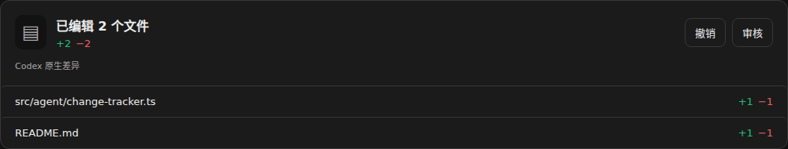
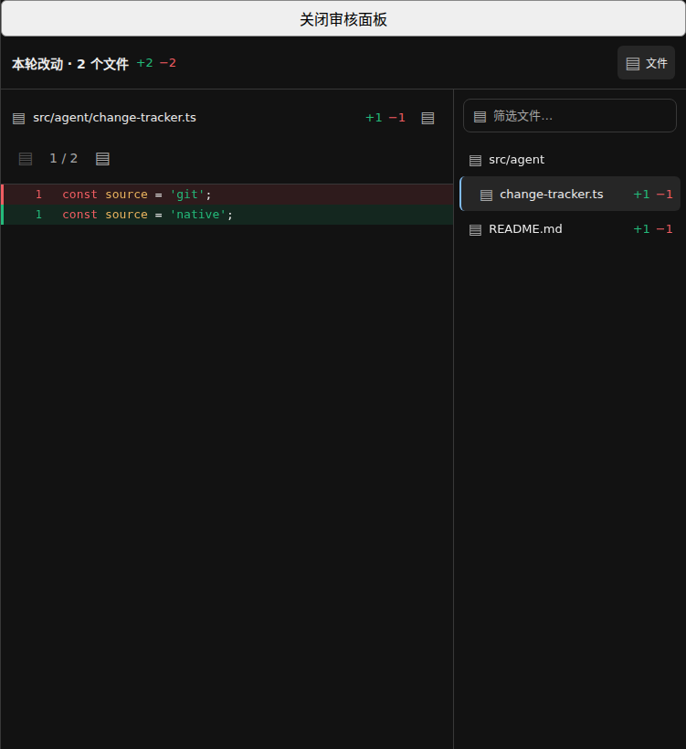

# 每轮改动

Paseo 插件，按一轮 Agent 执行汇总文件改动。在回答后显示文件数量、增删行数和文件列表，点击文件或“审核”查看当轮差异；“撤销”恢复这一轮之前的文件内容。

## 界面预览

以下截图使用实际插件组件和模拟文件数据；审核面板外框为测试宿主，不包含真实项目内容。





## Install

需要 Paseo 客户端与 daemon 均为 `0.8.x` 正式版，并已开启目标主机的插件功能。在连接该主机的 Paseo CLI 中运行：

```sh
paseo plugin add Laokashouji/paseo-turn-changes
```

默认配置可直接使用官方 Paseo，无需宿主补丁：Codex 优先使用原生本轮差异，不可用时自动汇总文件编辑记录；其他执行后端默认汇总文件编辑记录。依赖在安装时按锁文件准备，无需发布到 npm。

更新已安装的 Git 来源插件：

```sh
paseo plugin update turn-changes
```

## Limitations

- 插件接口限定为 `>=0.8.0 <0.9.0`；Codex 原生差异需要下文的可选接入补丁，默认自动模式无需补丁。
- 纯插件模式依赖结构化文件编辑记录，无法完整追踪 Shell 直接写文件。
- 记录不完整、工作目录外文件或文件已有后续修改时，不提供自动撤销；能获取的编辑内容仍可审核。
- 界面当前为中文；已验证网页桌面和窄屏布局，Android、iOS 原生客户端尚未验收。
- 差异记录包含文件内容，保存在运行插件的主机上；不自动清理历史，卸载后仍保留。

## 当前状态

- 已在隔离的 Paseo `0.8.0` 正式版 daemon 验证插件安装、两种来源、连续两轮、历史持久化和撤销。仅安装生产依赖的源码也通过相同验证。
- 默认 Codex 自动选择来源：本轮有原生接口信号时使用原生累计差异，没有信号时汇总结构化编辑记录。其他执行后端默认由插件汇总结构化编辑记录。
- 原生路径需要本仓库的接入补丁；自动模式和纯插件路径可直接使用官方 Paseo 0.8。
- 真实 Claude 会话已验证文件统计、差异卡片、后续修改保护和撤销。
- Codex 原生路径通过真实文件编辑测试、脚本事件集成测试与宿主 153 项接入测试；未打补丁的正式版也已验证 Codex 自动使用插件汇总、审核和撤销。宿主补丁已提交 [官方 PR #4700](https://github.com/getpaseo/paseo/pull/4700)，上游合入状态以该 PR 为准。
- 真实 Paseo 网页客户端已验证设置页、历史记录卡片、文件审核及 390px 窄屏弹层，数据来自真实 Claude 编辑记录。组件交互回归另使用 React Native Web 和 jsdom；网页窄屏验证不等同于 Android 或 iOS 原生客户端验证。

## 界面入口

有改动的轮次结束后，对话中增加一张“已编辑 N 个文件”卡片。没有改动且没有异常时不插入空卡片。文件列表默认显示前六项，可以展开全部。历史卡片的差异保存在生成时，不随后续编辑或 Git 提交变化。

- 点击文件或“审核”：在 Paseo 原生右侧面板查看差异，可切换上一个、下一个文件。新增与删除使用整行红绿底色、对应行号和左侧细条，代码使用 Paseo 的语法高亮库；补丁未包含的行只标明省略数量。保留左侧对话，宽度由 Paseo 管理并可拖动调整；0.8.0 默认 320px，插件的公开接口不支持指定初始宽度。窄屏或缺少工作区上下文时使用原生弹层；0.8.0 的 Explorer 打开接口不会展开窄屏抽屉。
- 点击“撤销”：二次确认后撤销整轮。任何文件出现后续修改时，整轮拒绝撤销。
- 不可撤销的原因只在鼠标悬停灰色撤销按钮时显示，不常驻卡片、文件列表或审核正文。网页和桌面使用浏览器原生提示，移动原生客户端通过无障碍提示读取原因。
- 审核面板达到 680px 时，左侧显示选中文件的差异，右侧显示本轮改动文件树。支持目录折叠、按文件名或完整路径筛选，选中文件显示底色；文件名和增删统计同时展示。点击顶部“文件”可收起列表。较窄的侧栏和手机通过“文件”切换到列表，选中后返回差异。列表来自本轮记录，不扫描工作目录。
- 文件标题右侧的“打开源文件”在同一审核侧栏内显示文本编辑器，支持保存和返回差异；不跳转窗口或创建工作区。保存会检查读取时的文件版本，冲突时保留草稿；返回差异前提醒未保存的修改。已归档并删除的 Paseo worktree 按保留的主仓库映射打开当前文件，实际路径显示在编辑器上方。仅支持 1 MiB 以内的 UTF-8 文本，未找到文件时不恢复或创建文件。
- Codex 插件汇总会按会话 ID 和已完成工具调用 ID，从本机 Codex 日志补充新增文件及同次多文件差异。自定义后端按 Paseo 配置中的 `extends` 识别，日志目录遵循该后端继承和覆盖后的 `CODEX_HOME`。日志缺失时保留原有记录；仅有正文而没有明确新增证据时不推算增删行数。审核旧记录也会补回同次调用遗漏的文件，保留原有文件顺序，仍不开放撤销。
- 工作区的“每轮改动”面板：查看当前 Agent 的历史记录。
- 命令中心：“查看每轮改动”“配置每轮改动来源”。
- 设置 → 插件 → `turn-changes` → 数据来源：设置每个执行后端的来源。

Paseo 0.8.0 的对话卡片在归档后重新打开会话时不会恢复：宿主没有持久化插件追加的消息，重建的模型历史也不含这张卡片。差异记录由本插件独立保存，仍可通过命令中心的“查看每轮改动”打开历史面板查看；不要把插件记录持久化与对话卡片持久化视为同一项能力。

`npm run test:ui` 会生成 `tmp/preview.html`，可直接在浏览器打开。预览使用真实插件组件、模拟数据及简化的宿主弹窗和设置控件；不能替代真实 Paseo 客户端验收。

## 配置

默认值：

```json
{
  "defaultSource": "edits",
  "providers": { "codex": "auto" }
}
```

`auto` 表示自动选择，`native` 固定使用原生本轮差异，`edits` 固定使用插件汇总。匹配的是 provider ID，不是模型名称。自定义 Codex provider ID 可在设置中单独添加。

设置从下一轮生效，历史记录保留原来源。同一 daemon 的客户端读取同一份配置；旧版本设置的保存会被拒绝，刷新后可重试。已有显式 `native` 配置仍为固定来源，需选择“自动（优先原生）”开启自动判断。

自动模式依据本轮结束事件是否包含 `nativeDiff` 判断能力，不依赖版本号或上一轮的缓存。字段缺失时使用插件汇总；字段为 `null` 或空字符串表示接口已接通但没有差异，不因此切换来源。卡片不展示来源说明，文件路径统一显示为改动所在主机上的绝对路径。自动选择本身不算记录异常，历史分页不完整或文件无法重建时仍会限制撤销。

设置页显示所配置原生来源最近一轮是否收到接口信号及检查时间，也可主动刷新。它是最近一次观察结果；安装后尚未完成轮次时显示“尚未确认”。移除某个执行后端的单独配置后，该后端使用“其他执行后端”的设置。

## 收集范围与撤销

Codex 接入层只保留当前轮次最新的 `turn/diff/updated`，在完成、失败或取消时传给插件，不把差异重复插入普通消息流。

纯插件路径读取本轮最终状态为 `completed` 的结构化文件编辑记录，按文件反向应用本轮操作，计算净变化。同一文件连续修改会合并，修改后又恢复原样的不计入文件列表。开始之前已有的未提交内容不通过 Git 基线覆盖。

以下情况会影响完整性：

- Shell 直接写文件且没有结构化编辑记录时，纯插件路径无法发现；它不等同于整个目录的变化监控。
- `Write` 或编辑记录缺少修改前内容、替换内容无法唯一定位、记录被截断时，不提供自动撤销。
- 暂不自动还原重命名、二进制文件、只有权限变化的记录、符号链接、工作目录之外及 `.git` 内部文件。
- 支持普通 UTF-8 文本及 Git 转义的中文路径。单个文件快照上限 2 MiB，每轮最多 200 个文件、24 MiB 快照总量。
- 插件重载后会恢复已持久化的本轮开始记录；缺少开始记录或历史分页不完整时，明确标为记录不完整。安装前的轮次不回填。

差异展示不以自动撤销成功为前提：文件在编辑后被格式化、位于工作目录外或无法还原时，仍展示已保存的编辑记录及增删行数。多次编辑无法合并时，审核页标注“编辑记录 · 行数为各次编辑合计”，可能包含重复修改或格式化前的内容。只有修改后内容时标注“修改后内容”，不把未知旧内容当作空文件，也不虚构增删行数。上述情况均不开启自动撤销，不读取工作目录外的当前文件。

旧记录会从已保存的补丁恢复展示统计；旧记录缺少正文时，仅在原对话的轮次、时间线版本和结束序号完全匹配时补充工具提供的内容。读取审核不会改写历史、当前文件或撤销状态。若原对话记录已不可用且插件当时没有保存内容，则无法补回。

撤销前检查所有文件的内容和权限，确认仍等于记录结束时的状态；执行期间逐文件复核，失败时尝试恢复已写入的文件，并保留错误状态。工作目录或其父子目录内有正在运行的 Agent 时禁止撤销。撤销不会修改 Git 暂存区、提交或分支。文件系统没有跨进程事务，撤销期间仍应避免编辑器或其他进程同时写文件。

## 存储

默认保存在 `${PASEO_HOME:-~/.paseo}/plugin-data/turn-changes`，可用 `PASEO_TURN_CHANGES_HOME` 指定隔离目录。设置和差异记录使用原子替换写入，文件权限为 `0600`；记录包含修改前后文本。

目录属于运行插件的 daemon，不跨设备自动同步。当前版本不自动清理历史；卸载插件后数据目录仍保留。

## 接入

`patches/codex-turn-diff.patch` 包含 Paseo 源码上下文及本插件所需修改；上游版权与许可保留在 [patches/PASEO-LICENSE](patches/PASEO-LICENSE)。

客户端和 daemon 需要匹配 Paseo 0.8 插件接口；清单要求 `>=0.8.0 <0.9.0`，不接受 0.7 或 0.8 beta。补丁基于官方 `v0.8.0`，提交 `b8e24677e12b226c7c38c1c3a40649daa9f1152f`，见 [patches/codex-turn-diff.patch](patches/codex-turn-diff.patch)。官方 0.8.0 仍会丢弃 Codex 原生累计差异事件；补丁改动 server 内部事件和插件服务端钩子，不修改客户端协议。

在对应 Paseo 源码根目录应用补丁并构建：

```sh
git apply --check /absolute/path/paseo-turn-changes/patches/codex-turn-diff.patch
git apply /absolute/path/paseo-turn-changes/patches/codex-turn-diff.patch
npm ci --ignore-scripts --include-workspace-root --workspace=@getpaseo/server --workspace=@getpaseo/cli --workspace=@getpaseo/client --workspace=@getpaseo/protocol --workspace=@getpaseo/plugin --workspace=@getpaseo/relay --workspace=@getpaseo/highlight
npm run build:server
```

以上仅构建，不替换或重启当前 daemon。切换运行版本需要按目标机器的 Paseo 安装方式操作；有活动会话时先安排切换窗口。桌面和网页客户端也需要匹配版本。

在已运行兼容版本的目标 daemon 上：

```sh
cd /absolute/path/paseo-turn-changes
npm ci --omit=dev --ignore-scripts
paseo plugin install /absolute/path/paseo-turn-changes
```

需事先开启目标 daemon 的插件功能，CLI 也需指向正确主机。多台机器分别安装和配置。

从 Git 安装时，清单中的构建命令会安装锁定的生产依赖。开发检查则运行不带 `--omit=dev` 的 `npm ci --ignore-scripts`。

## 开发验证

```sh
npm run typecheck
npm run lint -- client server shared index.client.tsx index.server.ts
npm test
npm run test:ui
npx tsx tests/daemon-smoke.mjs /absolute/path/paseo-turn-diff-host
```

集成测试使用随机端口、独立存储和脚本测试后端，不访问主 daemon、真实模型或真实工作文件，结束后关闭临时服务并清理目录。回执在 `tmp/daemon-smoke.json`、`tmp/ui-smoke.json`。

可通过 `PASEO_TEST_PLUGIN_ROOT` 指定仅安装生产依赖的插件副本，验证实际安装时的模块解析。

Paseo 补丁测试在其 `packages/server` 下运行：

```sh
npx vitest run src/server/agent/providers/codex-app-server-agent.test.ts --bail=1
```
